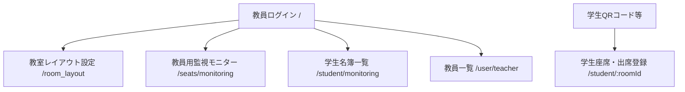
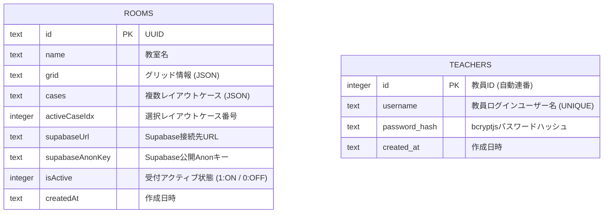

# 🪑 Seats & Check Studio

教室の座席配置を直感的に作成・編集し、**Supabase Realtime** を使って学生の授業理解度（OK/NG状態、コメント、応答レイテンシ）を教員がリアルタイムに監視できる、極めて型安全なフルスタック・モノレポアプリケーションです。

> [!NOTE]
> **アーキテクチャ・詳細設計について**
> データベース設計、ER図、およびリアルタイム通信フローの仕様については [`er_diagram.md`](./er_diagram.md) をご参照ください。

---

## ⚡️ クイックスタート (起動手順)

### 1. 依存関係のインストール
プロジェクトのルートディレクトリで以下を実行します。
```bash
npm install
```

### 2. ローカル SQLite (D1) データベースのセットアップ
バックエンド（D1）のマイグレーションファイルをローカルに適用します。
```bash
# packages/backend に移動して実行
cd packages/backend
npx wrangler d1 migrations apply DB --local
```

### 3. ローカル開発サーバーの起動
ルートディレクトリから、フロントエンドと API（バックエンド）の双方のサーバーを起動します。
```bash
# バックエンドサーバーの起動 (http://127.0.0.1:8787)
npm run dev:backend

# フロントエンドサーバーの起動 (http://localhost:5173)
npm run dev:frontend
```
起動完了後、ターミナルに表示されたアドレスにブラウザでアクセスしてください。

---

## 🏗️ 画面構成とルーティング (最新マップ)

本アプリケーションは、`react-router-dom` を用いて教員画面（要認証）と学生画面が完全に分離されています。これにより、パフォーマンス向上と強固なセキュリティ（画面遷移の制限）を実現しています。



### 👨‍🏫 教員向け画面 (認証保護)
* **ログイン画面 (`/`)**: 
  D1 データベースの教員アカウント情報を用いたセキュアな認証ログイン。入力パスワードは `bcryptjs` ハッシュ照合され、セッションJWTトークンを発行。環境変数によるハードコードを排した、本格的なセキュリティ制限を適用します。
* **レイアウトスタジオ (`/room_layout`)**: 
  教室の座席レイアウトを直感的にドラッグ＆ドロップで作成・変更できるエディタ。12×12の広大な座席グリッドに対応し、最大5パターン（Case 1〜5）の座席構成を自由に管理・保存可能。
* **教員用監視モニター (`/seats/monitoring`)**: 
  Supabase Realtime と連携した最大画面の監視コンソール。12×12対応のグリッドは高精細かつレスポンシブで、学生の理解度（OK/NG）のリアルタイム更新、NG席の脈動（パルス）アニメーション、座席ロック、一括リセット、高精度な通信遅延測定をサポート。
* **学生名簿 (`/student/monitoring`)**: 
  各教室のアクティブなチェックイン学生をグリッド/テーブル形式で一覧表示（`/user` から自動リダイレクト）。リアルタイムでの同期更新、検索、不要な着席登録の強制解除（Eviction）、および出席名簿の CSV 出力をサポート。
* **教員一覧 (`/user/teacher`)**: 
  オンライン・アクティブな教員アカウントを管理・表示するシミュレーションディレクトリ。

### 👩‍🎓 学生向け画面 (`/student/:roomId` または `/student`)
* **チェックインウィザード (ログイン & 座席選択)**:
  QRコードやURLからアクセスすると、D1 データベースから該当教室の座席レイアウトと Supabase 接続設定を自動的に取得。
  学生は **「学生名」** および **「学生番号 (Student ID)」** を入力し、インタラクティブマップから自分の席を選択してチェックインします。
* **ステータスダッシュボード (極上ムードセレクター)**:
  チェックインが完了すると、直感的かつゲーム感覚でタップできる **2×3の6ボタン・ムードセレクターグリッド** （✨ バッチリ！, 💡 なるほど！, ✍️ メモ待って, ❓ むずかしい, 📢 声が遠い, ❄️ 暑い・寒い）が表示されます。タイピングの負担をゼロにし、スライドの進度や音響・空調トラブルなど講義室のあらゆる状況を1タップでリアルタイムに教員へ伝達できます。
* **自動座席ロック同期**:
  教員が「座席ロック」を有効にすると、学生画面側での「席の変更」ボタンやグリッドが自動的に無効化され、なりすましや座席のいたずら移動を防止します。

---

## 🗄️ データベース設計 (D1 SQLite ER図)

本システムは Cloudflare D1 (SQLite 互換) データベースを使用し、教室のレイアウト永続データおよび教員のセキュアな認証情報をセキュアに保持します。



---

## 🔑 Supabase 接続設定と「完全分散型」アーキテクチャ

本システムは、**「完全分散型セルフホストアーキテクチャ」** を採用しています。
中央集権的な1つの Supabase サーバーに全アクセスを集中させるのではなく、**各教員が自身の無料 Supabase プロジェクトを発行し、それを各々の教室（D1 DB）に登録して利用する** ことで、同時接続数の上限（無料枠の限界）を根本的に回避する設計です。

### Step 1. Supabase でプロジェクトを作成する
1. [Supabase 公式サイト](https://supabase.com) にアクセスし、サインインします。
2. ダッシュボード画面で「**New Project**」をクリックします。
3. 以下の推奨設定を入力し、「**Create new project**」をクリックします。
   * **Region (リージョン)**: 日本で利用する場合は **`Northeast Asia (Tokyo)`** を選択します（リアルタイム通信の遅延を最小化するため最も重要です）。
   * **Security (セキュリティ項目)**:
     * **`Enable Data API`**: **ON**
     * **`Automatically expose new tables`**: **OFF (推奨)**
     * **`Enable automatic RLS`**: **ON (推奨)**

### Step 2. API 接続情報の確認と登録
プロジェクトが起動したら、接続設定用のキーをコピーします。

1. 左メニューの「⚙️ **Project Settings**」 > 「🔑 **API**」を選択します。
2. 画面に表示される以下の2つの値をコピーし、教員画面の **「Supabase 接続設定」** に入力し、**「設定を保存 (D1へ同期)」** を押します。
   * 🌐 **Project URL**: `https://xxxxxxxxxxxxxxxxxxxx.supabase.co` 
   * 🔑 **Project API keys (anon / public)**: `eyJhbGciOi...` で始まる文字列。

> [!IMPORTANT]
> **重要: 鍵の種類に注意してください**
> * **使用するもの**: Labelが **`anon / public`** となっているキー。これはブラウザに公開しても安全な鍵です。
> * **絶対に使用しないもの**: Labelが **`service_role / secret`** となっているキー。これはデータベースを直接操作される危険性があるため絶対に公開しないでください。

入力後、教室レイアウトを保存すると、この設定情報が D1 データベースに書き込まれます。学生はQRコードからアクセスした際、この設定を自動で取得して通信を開始します。特別なデータベースのテーブル作成などは一切不要です。

---

## 🚀 プレミアム技術的ハイライト

### 1. Zod 単一ソース化（Single Source of Truth）による完全型安全モノレポ
`shared` パッケージにすべてのデータモデルとバリデーションルール（Zod Schema）を配置し、フロントエンドとバックエンドの双方でそれらを完全再利用。
API 通信は Hono RPC（`hc`）でラップされ、型定義の重複を 100% 排除した堅牢な開発体験（DX）を実現しています。

### 2. 高精度な応答遅延計測 (Latency Tracking)
学生が OK/NG ボタンを送信した際、メッセージパケット内に正確なタイムスタンプ（Unix Epoch）を内包させ、教員のブラウザがそれを受信した時点の時間差から **ミリ秒単位の通信遅延（レイテンシ）** を算出。
ネットワーク環境の健全性やアクティブな疎通状態を視覚的にトラッキングできます。

### 3. 学生番号 (Student ID) の厳格なバリデーション
ログイン画面にて、半角英数字のパターンバリデーションおよび入力時にリアルタイムで英大文字に自動置換するフィルタリング機能を搭載。表記ゆれや入力ミスをクライアントサイドでシャットアウトします。

### 4. 履歴キャッシュ機能と Excel 互換マトリックス CSV エクスポート
教員が「一括リセット」を行った際、それまでの学生のステータス情報（学生番号、名前、最新状態、応答速度など）をブラウザの `localStorage` へ自動的に履歴セッションとしてバックアップ保存します。
出力する CSV は、**学生を行**、**各質問セッション（回答回）を列**とした、教務管理に極めて実用的なマトリックス形式（Pattern A）を採用。さらに Excel で開いても一切文字化けしない **UTF-8 with BOM** 形式で出力されます。

### 5. 常時接続の再利用による超低遅延ライフサイクル管理 (useRef パターン)
WebSocket 接続やリアルタイム購読を React 上で完全に安定動作させるため、関数の参照安定化パターンを採用。
変化するコールバック関数や状態を `useRef` で同期・保持することで、接続購読用の `useEffect` から揮発性依存関係を完全に排除。同じチャンネル名での多重 subscribe のバグを根本から解決し、接続の切断・再接続ロスを完全にゼロにしています。

### 6. セッション有効期限切れ (JWT 401) のグローバル・インターセプター検知
API クライアント（Hono RPC）に **Response Interceptor（カスタム fetch）** を導入。セッションJWTトークン（有効期限24時間）が切れた状態でリクエストした際、API からの `401 Unauthorized` を全自動でインターセプトし、教員をセキュアにログイン画面（`/?expired=true`）へ強制リダイレクト。ログイン画面マウント時に「セッションの有効期限が切れました」とトースト警告を表示する、漏れのないセキュアなライフサイクル管理を実現しています。

### 7. 大教室接続上限を克服する「自動 HTTP フォールバック（自動ポーリング）機能」
Supabase Free Plan の同時接続限界（200デバイス）を回避・防衛するため、学生側の WebSocket 接続不全（`CHANNEL_ERROR` や `TIMED_OUT`）をリアルタイムに自動検知。
切断をフックすると同時に、ユーザーにトーストで安心通知を出し、全自動で **「7秒間隔の本番 D1 データベース HTTP ポーリング」**（自動バックアップ同期）にシームレスに切り替えます。学生画面上部には脈動・回転するバナーが自動描画され、一切のサイレント不通を根絶しています。

### 8. アーキテクチャ強化・保守用設計書の完備
将来の Pusher / 自前 WebSocket への1秒でのマイグレーションやオフライン自動ユニットテスト（100倍高速化）を可能にする **リアルタイム層 DI（Dependency Injection）設計書 ([`realtime_di_design.md`](./docs/realtime_di_design.md))**、および全12本の REST API 完全ドキュメント（[`api_spec.md`](./api_spec.md)）を完備。保守拡張における万全のドキュメンテーションを備えています。

### 9. 非同期ステートバッチングを解消した「完全同期ブロードキャスト送信」
React のステート更新関数（`setState`）が持つ非同期性（バッチ処理）による「1回目のボタンタップで古いステートが送信されてしまう同期ラグ」を解消するため、送信ハンドラーに **即時文字列オーバーライドパラメータ** を増設。ボタンタップと同時に画面用ステートと通信用ペイロードへ同一の即時文字列を渡すことで、遅延ゼロ・取りこぼしゼロで教員の監視モニターへ瞬時に状態を届ける超快感レスポンスを実現しています。

### 10. 引き算の美学による「ゼロノイズ・モニタリンググリッド」
教員の監視負担を劇的に軽減するため、グリッドセルのスタイリングに **引き算の美学** を導入。着席学生は鮮やかな理解度カラーで塗りつぶし、未着席の空席は「枠線のみ・塗りつぶしなし（透明）」、そして通路や非設定セルは「枠線すら表示しない完全な透明（ゼロ表示）」へと最適化。視覚的ノイズを完全に削ぎ落とし、教員が画面を見た瞬間に実際の教室の着席レイアウトが直感的に浮かび上がる極上の UX を提供します。

### 11. フロントエンドのUIコンポーネント細分化とクリーンアーキテクチャ
数百行に肥大化しがちなReactのページコンポーネント（教員一覧、学生名簿、ライブ監視など）を徹底的にリファクタリング。`TeacherStatsWidgets` や `MonitorControlBar` など機能ごとの細かなUI部品（Components）として完全に切り出し、ページファイル自身は「状態（State）を管理して部品に渡すだけの純粋なコンテナ（Container）」として動作する美しい設計パターンを確立しました。また、各画面に散らばっていた `localStorage` への直接アクセスを全て統合モジュール (`lib/storage.ts`) へカプセル化し、長期的な保守性と拡張性を極限まで高めています。

---

## 📂 フォルダ構成と使用技術

本プロジェクトは `npm workspaces` を用いたモノレポ構成です。

* **`packages/shared/`**: 
  型の源泉。Zod スキーマでデータ構造（`RoomLayout`, `SeatStatus`, `BroadcastEvent`）を一元管理。
* **`packages/backend/`**: 
  Cloudflare Workers ＋ Cloudflare D1 (SQLite) ＋ Hono。教室レイアウト、Supabase 設定情報、およびアクティブ状態を永続化。
* **`packages/frontend/`**: 
  Vite ＋ React ＋ React Router ＋ Hono RPC ＋ @dnd-kit (ドラッグ＆ドロップエディタ) ＋ Supabase JS ＋ Lucide Icons。
