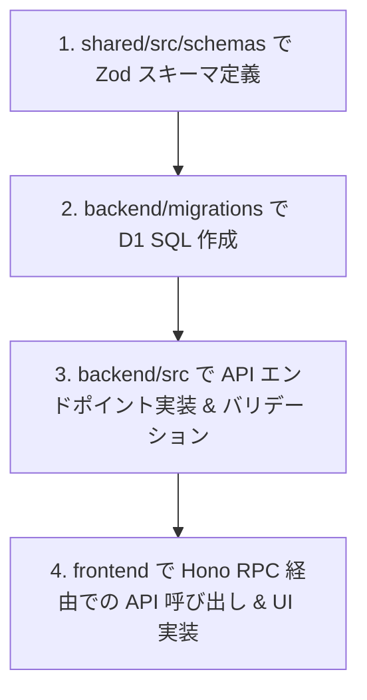

# 🛠️ Seats & Check - 開発者・貢献者向けガイド (contributor.md)

本プロジェクト（`sheat-check`）へ貢献（開発、バグ修正、機能追加）するための技術的ガイドラインです。

---

## 🏗️ 1. 技術スタックと構成
本プロジェクトは、フロントエンドからバックエンドまでを完全な型安全で繋ぐために `npm workspaces` を用いたモノレポ構成で構築されています。

* **モノレポ構成 (npm workspaces)**:
  * `packages/shared/`: アプリケーション全体のデータ構造、バリデーションルール、共通型定義（TypeScript / Zod）
  * `packages/backend/`: Hono (API) + Cloudflare Workers + D1 Database (SQLite 互換)
  * `packages/frontend/`: React + Vite + TypeScript (UIクライアント)
* **型安全 RPC 通信**:
  * **Hono RPC Client (`hc`)** を用いて、バックエンドのルーターの型 (`AppType`) をフロントエンド側へインポートし、API 通信時のリクエスト/レスポンスの型安全性を 100% 担保しています。

---

## 📂 2. 各パッケージの責責と依存ルール

### 1. `packages/shared/` (最優先・型の源泉)
* **責務**: データ構造、バリデーションスキーマの定義。
* **開発ルール**:
  * 新機能の追加や仕様変更の際は、**必ず最初にここの Zod スキーマ (`src/schemas/`) を定義・修正すること。**
  * 外部（Backend/Frontend）から参照されるスキーマや型は、必ず `src/index.ts` からエクスポートしてください。インポートパスは `@my-app/shared` に一本化されます。
  * `react` や `hono` などの実行環境固有のライブラリに依存するコードは絶対に含めないでください。

### 2. `packages/backend/` (API & データベース)
* **責務**: Hono APIサーバーと D1 データベースの管理。
* **開発ルール**:
  * リクエストのバリデーションには、必ず `@hono/zod-validator` と `shared` の Zod スキーマを使用してください。
  * データベーススキーマに変更がある場合は、必ず `migrations/` ディレクトリにマイグレーション用の SQL ファイルを作成してください（SQLite 互換）。

### 3. `packages/frontend/` (UI & クライアント)
* **責務**: フロントエンド UI アプリケーション。
* **開発ルール**:
  * API 通信には、`fetch` や `axios` を直接使わず、必ず `src/lib/hc.ts` に定義された `hc` (Hono RPC クライアント) を経由して呼び出してください。
  * フォームのバリデーションには `react-hook-form` と `@hookform/resolvers/zod` を用い、`shared` の Zod スキーマを適用してください。

---

## 🔄 3. 標準開発フロー (必須手順)
新機能を開発する際は、以下のステップを厳守してください。



1. **Schema**: `shared` で Zod スキーマを定義し、`shared/src/index.ts` から再エクスポートする。
2. **Migration**: データベース変更がある場合は、`backend/migrations/` に SQL を追加。
3. **API**: `backend` にエンドポイントを作成し、スキーマバリデーションをかける。
4. **UI**: `frontend` にコンポーネントを作成し、Hono RPC 経由で API を呼び出す。

---

## 🚀 4. ローカル開発環境の起動

1. **リポジトリのクローンと依存関係のインストール**:
   ```bash
   git clone https://github.com/matsutanishimpei/sheat-check.git
   cd sheat-check
   npm install
   ```

2. **ローカル開発サーバーの起動**:
   モノレポのルートディレクトリから以下のコマンドを実行します。
   * バックエンド（Workers ローカル開発環境）の起動:
     ```bash
     npm run dev:backend
     ```
   * フロントエンド（Vite 開発環境）の起動:
     ```bash
     npm run dev:frontend
     ```

---

## 🧪 5. 検証（型チェック・テスト・ビルド）

PR（プルリクエスト）を作成、または `main` へプッシュする前に、必ずローカルで以下のコマンドを実行し、正常終了することを確認してください。

1. **型チェックの実行 (各パッケージ個別)**:
   ```bash
   npm run typecheck
   ```
2. **テストの実行 (Vitest)**:
   ```bash
   npm run test
   ```
3. **本番用ビルドの確認**:
   ```bash
   npm run build
   ```

これらは GitHub Actions (CI) でも自動的に検証され、型エラーまたはテスト失敗が発生した場合は自動的にデプロイが差し止められます。
