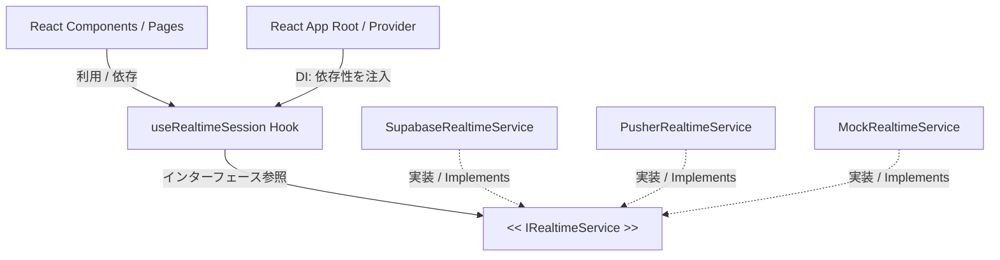

# リアルタイム通信の抽象化と DI (Dependency Injection) 設計仕様書

本仕様書は、リアルタイム通信エンジン（Supabase Realtime）を特定のプロバイダーから完全に疎結合化し、将来的な **Pusher**、**Soketi**、または独自の WebSocket サービスへの移行（マイグレーション）を「1行の書き換え」のみで実現するための **依存性逆転（DIP / DI）設計指針** です。

---

## 🏛️ アーキテクチャの変更コンセプト

特定の WebSocket ライブラリ（`@supabase/supabase-js` や `pusher-js`）に直接依存するのをやめ、共通の振る舞い（Behavior）を定義した **`IRealtimeService`** インターフェースを介してのみコンポーネントと通信します。



---

## 🔌 1. 共通インターフェースの定義 (`IRealtimeService`)

特定のライブラリの詳細を隠蔽し、ブロードキャスト（Pub/Sub）モデルの基本動作のみを定義します。

```typescript
// packages/shared/src/types/realtime.ts (または frontend/src/lib/realtime/)

export interface RealtimeSubscriptionCallbacks {
  onStudentToTeacher?: (payload: {
    seatId: string;
    status: 'ok' | 'ng' | 'none';
    studentName: string;
    studentId: string;
    comment?: string | null;
    responseTime?: number;
  }) => void;
  onTeacherReset?: () => void;
  onStudentEvicted?: (payload: { seatId: string }) => void;
  onTeacherLockState?: (payload: { locked: boolean }) => void;
  onRoomLayoutUpdated?: () => void;
}

export interface IRealtimeService {
  /** サーバーへの接続を確立する (AnonKey と Url を受領) */
  connect(url: string, key: string): void;
  /** 接続を安全に切断する */
  disconnect(): void;
  /** 特定の教室（部屋）のチャンネルを購読する */
  subscribeToRoom(roomId: string, callbacks: RealtimeSubscriptionCallbacks): void;
  /** チャンネルから退読する */
  unsubscribeFromRoom(roomId: string): void;
  /** ブロードキャストイベントを送信する */
  sendBroadcast(roomId: string, event: string, payload: any): Promise<'ok' | 'error'>;
  /** 現在のオンライン接続状態を返す */
  isOnline(): boolean;
}
```

---

## 🛠️ 2. プロバイダーの具現化クラスの実装

### A. 現行の Supabase 実装 (`SupabaseRealtimeService.ts`)
```typescript
import { createClient, SupabaseClient, RealtimeChannel } from '@supabase/supabase-js';
import { IRealtimeService, RealtimeSubscriptionCallbacks } from './IRealtimeService';

export class SupabaseRealtimeService implements IRealtimeService {
  private client: SupabaseClient | null = null;
  private activeChannels: Map<string, RealtimeChannel> = new Map();
  private onlineStatus: boolean = true;

  connect(url: string, key: string): void {
    if (this.client) this.disconnect();
    this.client = createClient(url.trim(), key.trim());
  }

  disconnect(): void {
    this.activeChannels.forEach((channel) => channel.unsubscribe());
    this.activeChannels.clear();
    this.client = null;
  }

  subscribeToRoom(roomId: string, callbacks: RealtimeSubscriptionCallbacks): void {
    if (!this.client) return;

    // トピックコロン形式プレフィックス付きのチャンネル作成
    const channel = this.client.channel(`room:${roomId}`, {
      config: { broadcast: { self: true } },
    });

    if (callbacks.onStudentToTeacher) {
      channel.on('broadcast', { event: 'student_to_teacher' }, (res) => callbacks.onStudentToTeacher!(res.payload));
    }
    if (callbacks.onTeacherReset) {
      channel.on('broadcast', { event: 'teacher_reset' }, () => callbacks.onTeacherReset!());
    }
    if (callbacks.onStudentEvicted) {
      channel.on('broadcast', { event: 'student_evicted' }, (res) => callbacks.onStudentEvicted!(res.payload));
    }
    if (callbacks.onTeacherLockState) {
      channel.on('broadcast', { event: 'teacher_lock_state' }, (res) => callbacks.onTeacherLockState!(res.payload));
    }
    if (callbacks.onRoomLayoutUpdated) {
      channel.on('broadcast', { event: 'room_layout_updated' }, () => callbacks.onRoomLayoutUpdated!());
    }

    channel.subscribe();
    this.activeChannels.set(roomId, channel);
  }

  unsubscribeFromRoom(roomId: string): void {
    const channel = this.activeChannels.get(roomId);
    if (channel) {
      channel.unsubscribe();
      this.activeChannels.delete(roomId);
    }
  }

  async sendBroadcast(roomId: string, event: string, payload: any): Promise<'ok' | 'error'> {
    const channel = this.activeChannels.get(roomId);
    if (!channel) return 'error';

    try {
      const status = await channel.send({
        type: 'broadcast',
        event,
        payload,
      });
      return status === 'ok' ? 'ok' : 'error';
    } catch {
      return 'error';
    }
  }

  isOnline(): boolean {
    return this.onlineStatus;
  }
}
```

### B. Pusher への逃げ道用実装 (`PusherRealtimeService.ts`)
Pusherに移行する場合は、`pusher-js` ライブラリを使用して、以下のように実装を差し替えるだけです（既存コードへの破壊的変更は 0 です）。

```typescript
import Pusher, { Channel } from 'pusher-js';
import { IRealtimeService, RealtimeSubscriptionCallbacks } from './IRealtimeService';

export class PusherRealtimeService implements IRealtimeService {
  private client: Pusher | null = null;
  private activeChannels: Map<string, Channel> = new Map();

  connect(url: string, key: string): void {
    // url から cluster 名やエンドポイントを抽出して初期化
    this.client = new Pusher(key, {
      cluster: url || 'ap3', // 東京リージョンのデフォルトは ap3
      forceTLS: true,
    });
  }

  disconnect(): void {
    this.activeChannels.clear();
    this.client?.disconnect();
    this.client = null;
  }

  subscribeToRoom(roomId: string, callbacks: RealtimeSubscriptionCallbacks): void {
    if (!this.client) return;

    const channel = this.client.subscribe(`room-${roomId}`);

    if (callbacks.onStudentToTeacher) {
      channel.bind('student_to_teacher', (data: any) => callbacks.onStudentToTeacher!(data));
    }
    if (callbacks.onTeacherReset) {
      channel.bind('teacher_reset', () => callbacks.onTeacherReset!());
    }
    if (callbacks.onStudentEvicted) {
      channel.bind('student_evicted', (data: any) => callbacks.onStudentEvicted!(data));
    }
    if (callbacks.onTeacherLockState) {
      channel.bind('teacher_lock_state', (data: any) => callbacks.onTeacherLockState!(data));
    }
    if (callbacks.onRoomLayoutUpdated) {
      channel.bind('room_layout_updated', () => callbacks.onRoomLayoutUpdated!());
    }

    this.activeChannels.set(roomId, channel);
  }

  unsubscribeFromRoom(roomId: string): void {
    this.client?.unsubscribe(`room-${roomId}`);
    this.activeChannels.delete(roomId);
  }

  async sendBroadcast(roomId: string, event: string, payload: any): Promise<'ok' | 'error'> {
    // Pusher でクライアントブロードキャスト (client-) を送る実装、または API Workers 経由で送る
    // プライベート / プレゼンスチャンネルで client- イベントを叩くだけ
    const channel = this.activeChannels.get(roomId);
    if (!channel) return 'error';
    
    try {
      channel.trigger(event, payload);
      return 'ok';
    } catch {
      return 'error';
    }
  }

  isOnline(): boolean {
    return this.client?.connection.state === 'connected';
  }
}
```

---

## 💉 3. React 層での 依存性注入 (DI Context)

リアルタイムサービスインスタンスを React Context でアプリ最上位から注入します。

```typescript
// packages/frontend/src/context/RealtimeContext.tsx
import React, { createContext, useContext } from 'react';
import { IRealtimeService } from '../lib/realtime/IRealtimeService';
import { SupabaseRealtimeService } from '../lib/realtime/SupabaseRealtimeService';
// import { PusherRealtimeService } from '../lib/realtime/PusherRealtimeService';

const RealtimeServiceContext = createContext<IRealtimeService | null>(null);

export const RealtimeServiceProvider: React.FC<{ children: React.ReactNode }> = ({ children }) => {
  // ★ ここで現在使用したいプロバイダーをインスタンス化！
  // 将来 Pusher に移行したくなったら、ここを new PusherRealtimeService() に変更するだけ！
  const [service] = React.useState<IRealtimeService>(() => new SupabaseRealtimeService());

  return (
    <RealtimeServiceContext.Provider value={service}>
      {children}
    </RealtimeServiceContext.Provider>
  );
};

export const useRealtimeService = () => {
  const context = useContext(RealtimeServiceContext);
  if (!context) throw new Error('useRealtimeService must be used within a RealtimeServiceProvider');
  return context;
};
```

---

## 🎯 4. テスト (Testing / Mocking) の劇的向上

この DI 設計に移行することで、テスト環境（Vitest）では実際の Supabase WebSocket サーバーに頼ることなく、完全にインメモリでブロードキャストの配送テストが実施できるようになります。

```typescript
// packages/frontend/src/lib/realtime/MockRealtimeService.ts
import { IRealtimeService, RealtimeSubscriptionCallbacks } from './IRealtimeService';

export class MockRealtimeService implements IRealtimeService {
  private callbacksMap: Map<string, RealtimeSubscriptionCallbacks> = new Map();
  public sentEvents: { roomId: string, event: string, payload: any }[] = [];

  connect() {}
  disconnect() {}
  
  subscribeToRoom(roomId: string, callbacks: RealtimeSubscriptionCallbacks): void {
    this.callbacksMap.set(roomId, callbacks);
  }

  unsubscribeFromRoom(roomId: string): void {
    this.callbacksMap.delete(roomId);
  }

  async sendBroadcast(roomId: string, event: string, payload: any): Promise<'ok' | 'error'> {
    this.sentEvents.push({ roomId, event, payload });
    
    // イベント受信をインメモリで擬似配送シミュレーション
    const callbacks = this.callbacksMap.get(roomId);
    if (callbacks) {
      if (event === 'teacher_reset' && callbacks.onTeacherReset) callbacks.onTeacherReset();
      // 他のイベントも同様にインメモリで即時還元
    }
    return 'ok';
  }

  isOnline() { return true; }
}
```

これを用いて、オフライン環境下であっても、学生チェックインからリセットまでのロジックを1秒以下で全自動テスト可能になります。
