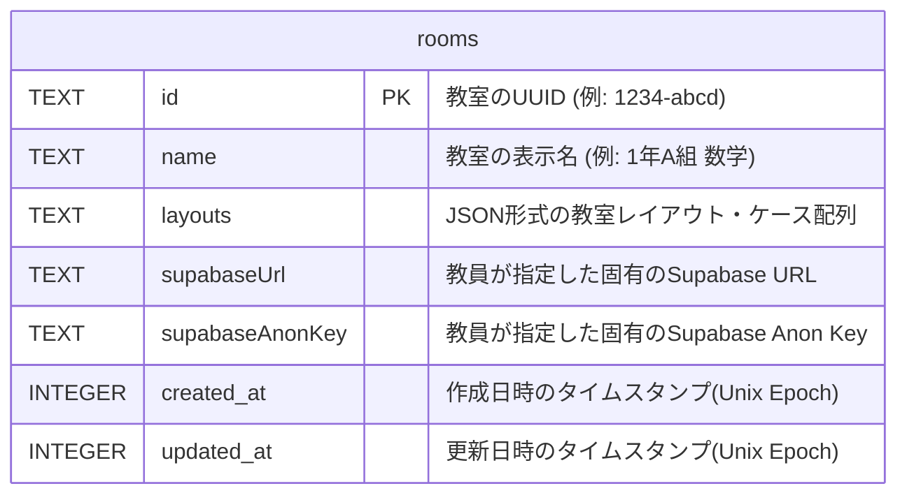
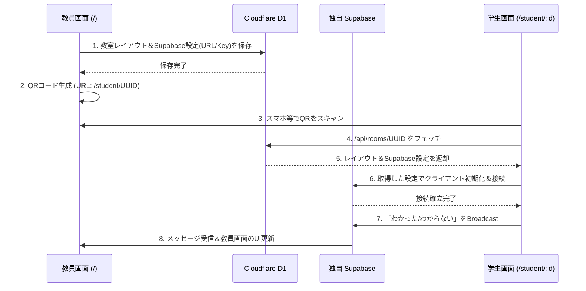

# 🪑 SeatCheck Studio - Entity Relationship (ER) Diagram & Architecture

本アプリケーションは、Cloudflare D1（SQLite）を用いた「永続化データ」と、Supabase Realtime を用いた「揮発性（リアルタイム）データ」のハイブリッドアーキテクチャを採用しています。

## 1. Cloudflare D1 Database (永続化)

教室のレイアウトや、各教員が設定した固有の Supabase 接続情報は、Cloudflare D1 データベースの `rooms` テーブルに保存されます。



### `layouts` カラムの JSON 構造 (Zod スキーマベース)
`rooms.layouts` の内部には、複数の「ケース（通常講義、グループワーク等）」の配列が JSON 形式で保存されています。

```json
[
  {
    "caseName": "通常講義 (標準)",
    "grid": {
      "4,0": "teacher",
      "0,8": "door",
      "8,8": "door",
      "1,2": "student",
      "2,2": "student"
      // "x,y" 座標をキーとし、"teacher" | "student" | "obstacle" | "door" のいずれかを値とする
    }
  }
]
```

---

## 2. Supabase Realtime Channels (揮発性データ / ブロードキャスト)

学生の理解度（OK/NG）や着席状態、教員からの座席リセット指示などはデータベースには一切保存されません。すべて Supabase のインメモリ `Broadcast` 機能を用いて、接続しているクライアント（ブラウザ）間で直接送受信されます。

チャンネルは `room_UUID` 単位で隔離されており、異なる教室のデータが混ざることはありません。

```mermaid
graph TD
    subgraph Supabase Realtime
        Channel[Channel: "room_UUID"]
        EventTeacher[Event: "teacher_reset" / "teacher_lock_state"]
        EventStudent[Event: "student_status"]
        
        Channel --> EventTeacher
        Channel --> EventStudent
    end

    TeacherUI(教員画面<br/>TeacherPage) --"座席リセット指示<br/>ロック指示"--> EventTeacher
    EventStudent --"OK/NGステータス<br/>名前/コメント"--> TeacherUI
    
    StudentUI1(学生A<br/>StudentPage) --"OK/NGステータス<br/>名前/コメント"--> EventStudent
    EventTeacher --"座席リセット指示<br/>ロック指示"--> StudentUI1
    
    StudentUI2(学生B<br/>StudentPage) --"OK/NGステータス<br/>名前/コメント"--> EventStudent
    EventTeacher --"座席リセット指示<br/>ロック指示"--> StudentUI2

    classDef default fill:#f9f9f9,stroke:#333,stroke-width:1px;
    classDef highlight fill:#e1f5fe,stroke:#0288d1,stroke-width:2px;
    class Channel highlight;
```

### ブロードキャストペイロード構造 (TypeScript)

**1. 学生から教員へ (`event: "student_status"`)**
```typescript
{
  seatId: string;    // "1,2" などの座標
  status: 'ok' | 'ng' | 'none'; // 理解度ステータス
  studentName: string; // "山田太郎"
  comment: string | null; // "ここがわかりません"
}
```

**2. 教員から学生へ (`event: "teacher_reset"`)**
```typescript
{
  timestamp: string; // リセットが実行されたISO時刻
}
```

**3. 教員から学生へ (`event: "teacher_lock_state"`)**
```typescript
{
  locked: boolean; // true(座席移動禁止) / false(解除)
}
```

---

## 3. 全体アーキテクチャフロー (入室からリアルタイム通信まで)

「完全分散型セルフホストアーキテクチャ」により、教員が用意した無料の Supabase リソースを、QRコード経由でアクセスした学生が直接利用します。


