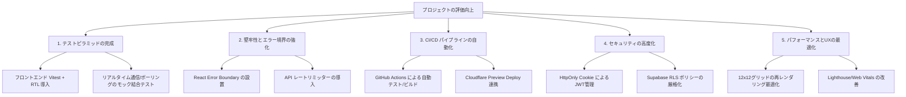

# 🪑 Seats & Check Studio - 技術的評価向上のための指摘事項

現在の「Seats & Check Studio」は、**Hono RPC による完全型安全モノレポ**、**Cloudflare D1 + Supabase Realtime による分散ハイブリッドリアルタイム通信**、**非同期ステートバッチングの解消**など、非常に優れた設計で構築されています。

このプロジェクトを商用グレード、あるいは極めて技術レベルの高いポートフォリオとして評価されるレベルに引き上げるために不足している、または改善の余地がある指摘事項をまとめました。

---

## 🎯 改善ロードマップ・全体像

---

## 1. テストピラミッドの完成 (品質保証の強化)
### 現状と課題
バックエンドの API エンドポイントや Repository パターンに対しては、インメモリのリポジトリを用いた Vitest による単体・結合テストが完備されています。しかし、**フロントエンド（React 側）のテストコードが不足**しており、品質保証の自動化に偏りがあります。

### 💡 改善策
1. **フロントエンド単体テストの導入**
   - `@testing-library/react` (React Testing Library) と `vitest` を用いて、主要な UI コンポーネント（`SeatCell`, `ControlPanel`, `ToastList` など）のレンダリングやユーザーイベントのハンドリングテストを記述する。
2. **カスタムフックの結合テスト**
   - `@testing-library/react-hooks` を使用し、Supabase リアルタイム同期や HTTP 自動ポーリングフォールバックロジックを持つカスタムフック（`useStudentRealtime`, `useTeacherRealtime`）の結合テストを記述する。
   - `msw` (Mock Service Worker) またはモック WebSocket を用いて、接続エラー時のポーリングへの自動フォールバック挙動を決定論的に検証する。

---

## 2. 堅牢性とエラー境界の強化 (レジリエンス)
### 現状と課題
ネットワーク切断時のポーリングへの自動フォールバックなど、例外処理は意識されていますが、React のレンダリング中に発生した想定外の JavaScript エラーや、API サーバーのダウンタイム時の大域的なハンドリングが不足しています。

### 💡 改善策
1. **React ErrorBoundary の導入**
   - 画面の最上部、および座席グリッドなどの複雑なサブコンポーネントの周囲に `ErrorBoundary`（または `react-error-boundary` ライブラリ）を配置し、万が一のクラッシュ時に画面全体が真っ白になるのを防ぎ、ユーザーに復帰アクション（リロード等）を提示する。
2. **バックエンドでの API レートリミット (Rate Limiting) の導入**
   - Cloudflare Workers 上で動く Hono API に、Cloudflare KV または `hono/rate-limiter` を用いた IP アドレスベースのレートリミットを適用。悪意のある連続リクエストや、学生によるポーリングの過剰アクセスからデータベースを保護する。

---

## 3. CI/CD パイプラインの完全自動化 (DevOps)
### 現状と課題
デプロイ手順書は存在しますが、コードの検証やデプロイがローカルでのコマンド実行（Wrangler）に依存しており、モダンな DevOps プラクティスに適合していません。

### 💡 改善策
1. **GitHub Actions ワークフローの構築**
   - リポジトリへの Pull Request 作成時、および `main` ブランチへのマージ時に、自動で以下のパイプラインを走らせる。
     1. 依存関係 of インストール & キャッシュ
     2. Linter / Formatter のチェック (`eslint`, `prettier`)
     3. TypeScript の型チェック (`tsc --noEmit`)
     4. テストスイートの実行 (`vitest run`)
     5. ビルドテスト (`npm run build`)
2. **Cloudflare Pages / Workers プレビュー連携**
   - Cloudflare の GitHub インテグレーションを活用し、Pull Request ごとにプレビュー環境（Vercel や Netlify のようなプレビュー URL）が自動生成される仕組みを設定する。

---

## 4. セキュリティの高度化 (Security)
### 現状と課題
JWT（JSON Web Token）は認証後にフロントエンドで取得され、ブラウザの `localStorage` やメモリ上に保持されています。これは XSS（クロスサイトスクリプティング）攻撃に対して脆弱です。また、Supabase のクライアントキーを D1 に保存して学生が取得する設計になっていますが、悪意ある学生による他教室へのブロードキャスト傍受のリスクがあります。

### 💡 改善策
1. **HttpOnly Cookie によるセッション管理**
   - Hono API でログイン成功時に JWT トークンを `HttpOnly` かつ `Secure`、`SameSite=Strict` の Cookie として発行する方式に切り替える。JavaScript からトークンを直接読み取れなくすることで、XSS によるトークン奪取を根本的に防ぐ。
2. **Supabase の RLS (Row Level Security) および JWT クレームの活用**
   - `/api/rooms/:id/student-token` で発行する学生用トークンのカスタムクレーム（`roomId`）を活用し、Supabase 側のセキュリティルール（RLS または Policy）で、自分が所属していない `roomId` のチャンネルへの Subscribe / Broadcast を拒否するよう設定する。

---

## 5. パフォーマンスとUXの最適化 (Optimization)
### 現状と課題
12×12（最大144セル）の座席グリッドを扱っており、かつリアルタイムで状態（遅延、OK/NG、コメント）が高速に変更されます。React のデフォルトの挙動では、1つのセルの状態が変わっただけでグリッド全体（144個の React 要素）が再レンダリングされ、低スペックなデバイスで動作させた際に一瞬カクつく原因になります。

### 💡 💡 改善策
1. **微細な再レンダリングの抑制 (Memoization)**
   - `SeatCell` コンポーネントを `React.memo` でラップし、プロパティ（学生のステータス情報など）が変更されたセルのみがピンポイントで再レンダリングされるように最適化する。
   - 親コンポーネント（`SeatMap`）のインライン関数やオブジェクトを `useCallback` / `useMemo` でキャッシュする。
2. **Lighthouse / Web Vitals の最高スコア化**
   - フォントファイルのローカルホスティング化（Google Fonts の最適化）。
   - 不要な CSS/JS コードのパージ（Vite のコード分割と圧縮）。
   - アクセシビリティ（WAI-ARIA 属性）の適用による、スクリーンリーダーやキーボード操作への対応強化。
