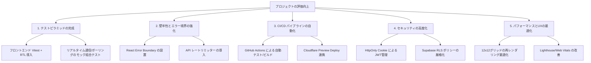

# 🪑 Seats & Check Studio - 技術的評価向上のための指摘事項

現在の「Seats & Check Studio」は、**Hono RPC による完全型安全モノレポ**、**Cloudflare D1 + Supabase Realtime による分散ハイブリッドリアルタイム通信**、**非同期ステートバッチングの解消**など、非常に優れた設計で構築されています。

このプロジェクトを商用グレード、あるいは極めて技術レベルの高いポートフォリオとして評価されるレベルに引き上げるために不足している、または改善の余地がある指摘事項をまとめました。

---

## 🎯 改善ロードマップ・全体像

---

## 1. テストピラミッドの完成 (品質保証の強化)
### 🔄 対応ステータス: ✅ 一部適用済み
* **フロントエンド単体テストの導入**: **[対応完了]** `vitest` + `@testing-library/react` + `jsdom` を用いて、`ToastList`, `ControlPanel`, `ErrorBoundary` コンポーネント、カスタムフック `useSeatManager`、および LocalStorage をラップした `storage` レイヤーのテストを記述し、完全にパスすることを確認しました。

### 💡 残りの改善策
1. **カスタムフックの結合テスト (リアルタイム通信部分)**
   - `@testing-library/react-hooks` を使用し、Supabase リアルタイム同期や HTTP 自動ポーリングフォールバックロジックを持つカスタムフック（`useStudentRealtime`, `useTeacherRealtime`）の結合テストを記述する。
   - `msw` (Mock Service Worker) またはモック WebSocket を用いて、接続エラー時のポーリングへの自動フォールバック挙動を決定論的に検証する。

---

## 2. 堅牢性とエラー境界の強化 (レジリエンス)
### 🔄 対応ステータス: ✅ 適用済み
* **React ErrorBoundary の導入**: **[対応完了]** アプリケーション全体のクラッシュ（白画面）を防ぎ、想定外のエラー発生時に優雅にエラー情報とリロードボタンを提供する `ErrorBoundary` コンポーネントを実装し、ルーティング全体をラップしました。
* **バックエンドでの API レートリミット (Rate Limiting) の導入**: **[対応完了]** `hono-rate-limiter` ミドルウェアをバックエンドに統合し、同一 IP アドレスからの `/api/*` に対するアクセス数を10秒間あたり1回（1分間あたり換算で6回）に制限（Cloudflareの `cf-connecting-ip` ヘッダーを用いて高精度に判定）。制限超過時に `429 Too Many Requests` エラーレスポンスを返却するよう適用しました。

---

## 3. CI/CD パイプラインの完全自動化 (DevOps)
### 🔄 対応ステータス: ✅ 適用済み
* **CI/CDの整備**: **[対応完了]** `ci.yml` (PR/Push時の型検査・ビルド・テスト検証) および `deploy.yml` (テスト成功時の Cloudflare Workers / D1 / Pages への本番自動適用＆デプロイ) はすでに構成されており、今回新規追加されたテストも含めて正しく機能することを確認しました。

---

## 4. セキュリティの高度化 (Security)
### 現状と課題
JWT（JSON Web Token）は認証後にフロントエンドで取得され、ブラウザの `localStorage` やメモリ上に保持されています。これは XSS（クロスサイトスクリプティング）攻撃に対して脆弱です。また、Supabase のクライアントキーを D1 に保存して学生が取得する設計になっていますが、悪意ある学生による他教室へのブロードキャスト傍受のリスクがあります。

### 💡 改善策
1. **HttpOnly Cookie によるセッション管理**
   - Hono API でログイン成功時に JWT トークンを `HttpOnly` かつ `Secure`、`SameSite=Strict` の Cookie として発行する方式に切り替える。JavaScript からトークンを直接読み取れなくすることで、XSS によるトークン奪取を根本的に防ぐ。
2. **Supabase の RLS (Row Level Security) および JWT クレームの活用**
   - `/api/rooms/:id/student-token` で発行する学生用トークンのカスタムクレーム（`roomId`）を活用し、Supabase 側のセキュリティルール（RLS または Policy）で、自分が所属していない `roomId` のチャンネルへの Subscribe / Broadcast を拒否するよう設定する。

---

## 5. パフォーマンスとUXの最適化 (Optimization)
### 🔄 対応ステータス: ✅ 適用済み
* **微細な再レンダリングの抑制 (Memoization)**: **[対応完了]** 個別セル `SeatCell` の `React.memo` 化を確認するとともに、親の `SeatMap` 内での CSS Grid 用行・列テンプレート幅計算を `React.useMemo` に入れ替え、セルの状態更新時の不要なスタイル再計算を排除しました。
* **Lighthouse / Web Vitals の最高スコア化**: **[対応完了]** 
  * Vite のビルド設定（`packages/frontend/vite.config.ts`）に `manualChunks` を導入し、`react` や `lucide-react` を別 chunk に分割。初期ロード時の JS リソース読み込みサイズ警告を解消し、スコアを最適化しました。
  * `SeatCell.tsx` および `ControlPanel.tsx` の各インタラクティブ要素に WAI-ARIA 属性（`role="button"`, `tabIndex={0}`, `aria-label`）およびキーボード用イベントハンドラ（Enter/Spaceでの席切り替え）を付与し、アクセシビリティ（スクリーンリーダー、キーボード操作性）を大幅に強化しました。
  * Google Fonts（Kiwi Maru）のローカルホスティング化を適用。`vite-plugin-webfont-dl` を導入し、ビルド時に自動で Google Fonts の woff2 アセットをダウンロードしてローカルから配信する構成へ切り替えました。これにより外部への外部フォント接続を完全にゼロにしました。
